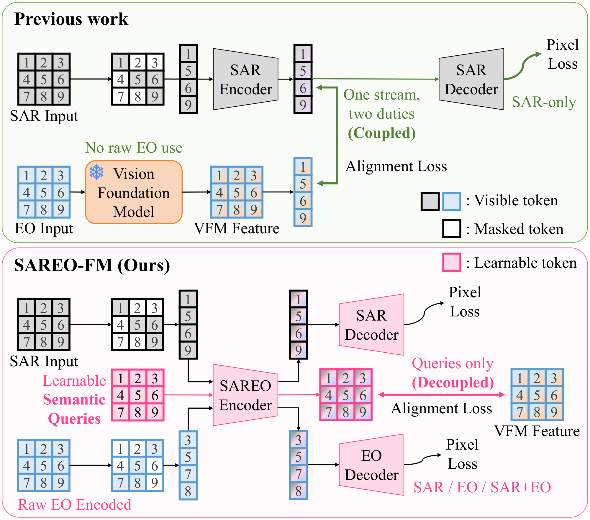
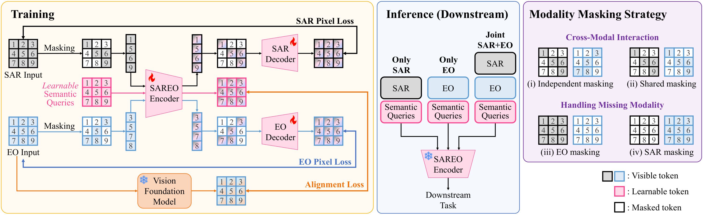
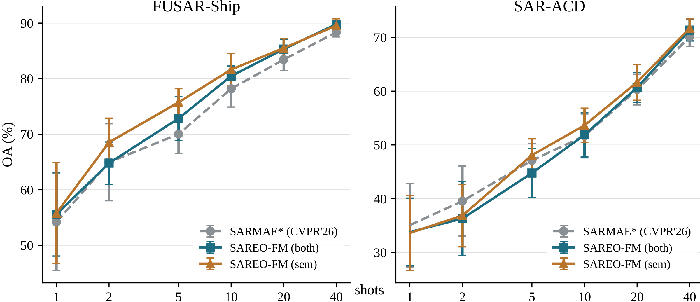
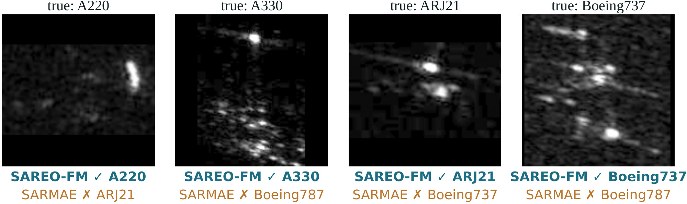
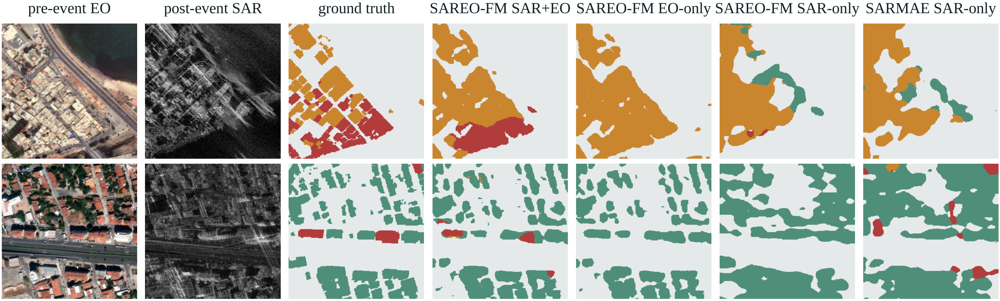

<div align="center">
<h2>SAREO-FM: Decoupled Semantic Supervision for SAR-EO Foundation Models</h2>

<div>
    <a href='https://jeonghyeokdo.github.io/' target='_blank'>Jeonghyeok Do</a><sup>1</sup>&nbsp;&nbsp;&nbsp;&nbsp;
    <a href='https://www.viclab.kaist.ac.kr/' target='_blank'>Munchurl Kim</a><sup>1†</sup>
</div>
<br>
<div>
    <sup>†</sup>Corresponding author
</div>
<div>
    <sup>1</sup>Korea Advanced Institute of Science and Technology (KAIST), South Korea
</div>

<div>
    <h4 align="center">
        <a href="https://kaist-viclab.github.io/SAREO-FM_site/" target='_blank'>
        
        </a>
        
        <!-- ARXIV_BADGE_START --><a href="https://arxiv.org/abs/2610.09317" target="_blank"></a><!-- ARXIV_BADGE_END -->
        
    </h4>
</div>
</div>

---

This repository is the official implementation of **"SAREO-FM: Decoupled Semantic Supervision for SAR-EO Foundation Models"**.

**SAREO-FM** is a unified MAE-based foundation model that learns from raw SAR and EO imagery with a shared encoder and supports SAR-only, EO-only, and joint SAR–EO transfer.

* 🧩 **Decoupled Semantic Supervision:** Alignment with a frozen EO vision foundation model (DINOv3) is assigned to learnable semantic queries, and masked pixel reconstruction to the SAR and EO modality tokens, while all three streams still interact within the shared encoder.
* 🛰️ **Mixed Modality Masking:** Independent masking, spatially shared masking, and complete dropping of either modality expose the same encoder to joint SAR–EO, SAR-only, and EO-only inputs during pretraining on the million-scale SAR-1M corpus.
* 📈 **Label-Efficient Transfer:** In controlled comparisons, SAREO-FM is best in five of the six SAR fine-tuning settings (+9.90 points over SARMAE<sup>\*</sup> on out-of-corpus 40-shot SAR-ACD), surpasses its frozen DINOv3 teacher at every shot count on few-shot EuroSAT with EO input, and reaches 66.70 micro-AP on 5-shot BigEarthNet-MM with joint SAR–EO input, 2.28 points above its best unimodal input.

---

## 📧 News
- **Oct 2026:** This repository is created.

## 💡 Motivation
<div align="center">
    
</div>
<p align="center"><sub><b>Figure 1. Motivation of SAREO-FM.</b> Prior methods directly align image tokens with EO-derived VFM features, coupling semantic alignment with pixel reconstruction. SAREO-FM instead supervises learnable semantic queries while reconstructing SAR and EO from modality tokens, separating the destinations of the two objectives within a unified encoder.</sub></p>

## 🖼️ Method Overview
<div align="center">
    
</div>
<p align="center"><sub><b>Figure 2. Overview of SAREO-FM.</b> Visible SAR and EO tokens interact with learnable semantic queries through a unified encoder. The modality-token outputs are decoded independently for masked pixel reconstruction, whereas the semantic-query outputs are aligned patch-wise with features from a frozen pretrained VFM. Semantic queries are excluded from the reconstruction decoders, separating the destinations of pixel-level and semantic supervision. Modality masking exposes the encoder to SAR-only, EO-only, and joint SAR–EO inputs; during downstream transfer, task heads selectively consume modality-token outputs, semantic-query outputs, or both.</sub></p>

## 📊 Results
Downstream heads use modality-token features (mod), semantic-query features (sem), or their concatenation (both). SARMAE<sup>\*</sup> is the official SARMAE ViT-B checkpoint re-evaluated under exactly the same downstream protocol as SAREO-FM.

### SAR Representation Transfer
<p align="center"><sub><b>Table 1. SAR target classification with end-to-end fine-tuning.</b> The upper block reports published OA (%) under the source-specific protocol of each method and is included only as context. The lower block reports our controlled evaluation with identical data splits and downstream pipelines; mean and standard deviation over three seeds are shown. <sup>*</sup> denotes our re-evaluation of the official SARMAE checkpoint. <b>Bold</b> denotes the best controlled result.</sub></p>

| Method | Venue | Backbone | FUSAR-Ship<br>40-shot | FUSAR-Ship<br>30% | MSTAR<br>40-shot | MSTAR<br>30% | SAR-ACD<br>40-shot | SAR-ACD<br>30% |
| :--- | :---: | :---: | :---: | :---: | :---: | :---: | :---: | :---: |
| *Published results* | | | | | | | | |
| ResNet-50 | CVPR'16 | ResNet-50 | – | 58.41 | – | 89.94 | – | 59.70 |
| Swin Transformer | ICCV'21 | Swin-B | – | 60.79 | – | 82.97 | – | 67.50 |
| BEiT | ICLR'22 | ViT-B | 59.70 | 71.13 | 40.70 | 69.75 | – | 79.77 |
| CROMA | NeurIPS'23 | ViT-B | 83.71 | – | – | – | – | 88.99 |
| SAR-JEPA | ISPRS JPRS'24 | ViT-B | 85.80 | – | 91.60 | – | 75.50 | – |
| SARATR-X | TIP'25 | HiViT-B | 87.70 | – | 98.10 | – | 76.40 | – |
| LoMaR | WACV'25 | ViT-B | 82.70 | – | 77.00 | – | 67.40 | – |
| SUMMIT | IJAEOG'25 | ViT-B | 81.50 | 71.91 | 63.60 | 98.39 | 68.70 | 84.25 |
| Copernicus-FM | ICCV'25 | ViT-B | 87.61 | – | – | – | – | 92.63 |
| CoDe-MAE | arXiv'26 | HiViT-B | 89.40 | – | 98.70 | – | 78.30 | – |
| MaRS | AAAI'26 | SwinV2-B | 77.70 | – | 75.50 | – | 68.40 | – |
| SARMAE | CVPR'26 | ViT-B | 89.30 | 92.92 | 96.70 | 99.61 | – | 95.06 |
| SARMAE | CVPR'26 | ViT-L | 90.86 | 92.80 | 97.24 | 98.92 | – | 95.63 |
| *Controlled evaluation* | | | | | | | | |
| Random initialization | – | ViT-B | 60.31<sub>±1.39</sub> | 82.11<sub>±0.52</sub> | 34.71<sub>±0.09</sub> | 38.76<sub>±8.35</sub> | 33.14<sub>±2.60</sub> | 39.19<sub>±10.27</sub> |
| SARMAE<sup>\*</sup> | CVPR'26 | ViT-B | 90.09<sub>±0.36</sub> | 92.82<sub>±0.21</sub> | 94.54<sub>±1.72</sub> | 97.18<sub>±0.32</sub> | 68.50<sub>±2.60</sub> | **95.01**<sub>±0.85</sub> |
| **SAREO-FM (sem)** | – | ViT-B | 91.05<sub>±0.16</sub> | **93.13**<sub>±0.14</sub> | **97.57**<sub>±0.42</sub> | 99.13<sub>±0.54</sub> | **78.40**<sub>±1.24</sub> | 93.34<sub>±0.55</sub> |
| **SAREO-FM (both)** | – | ViT-B | **91.41**<sub>±0.23</sub> | 93.12<sub>±0.06</sub> | 96.66<sub>±0.31</sub> | **99.36**<sub>±0.47</sub> | 78.00<sub>±1.00</sub> | 92.84<sub>±0.68</sub> |

<br>
<div align="center">
    
</div>
<p align="center"><sub><b>Figure 3. Frozen few-shot SAR transfer.</b> We use fixed encoder features and train only the downstream classifier.</sub></p>

<details>
<summary>Exact values behind Figure 3 (Table 6 of the Appendix)</summary>

<p align="center"><sub><b>Table 6. Exact frozen few-shot SAR classification results corresponding to Fig. 3 of the main paper.</b> We freeze the pretrained encoder and optimize only a linear downstream classifier. We report mean OA (%) and sample standard deviation over five matched support draws. sem uses semantic-query features, whereas both concatenates modality-token and semantic-query features. SARMAE<sup>*</sup> denotes the official checkpoint evaluated with the same downstream protocol. <b>Bold</b> and <ins>underline</ins> denote the best and second-best values within each dataset and shot count, respectively.</sub></p>

| Dataset | Method / Feature | 1-shot | 2-shot | 5-shot | 10-shot | 20-shot | 40-shot |
| :--- | :--- | :---: | :---: | :---: | :---: | :---: | :---: |
| FUSAR-Ship | SARMAE<sup>\*</sup> | 54.19<sub>±8.69</sub> | <ins>64.95</ins><sub>±6.93</sub> | 70.03<sub>±3.48</sub> | 78.18<sub>±3.28</sub> | 83.44<sub>±2.03</sub> | 88.35<sub>±0.83</sub> |
| | **SAREO-FM (both)** | <ins>55.56</ins><sub>±7.50</sub> | 64.79<sub>±3.81</sub> | <ins>72.84</ins><sub>±3.97</sub> | <ins>80.46</ins><sub>±1.81</sub> | <ins>85.32</ins><sub>±1.79</sub> | **89.81**<sub>±0.70</sub> |
| | **SAREO-FM (sem)** | **55.79**<sub>±9.07</sub> | **68.54**<sub>±4.35</sub> | **75.74**<sub>±2.46</sub> | **81.65**<sub>±2.91</sub> | **85.50**<sub>±1.71</sub> | <ins>89.56</ins><sub>±1.22</sub> |
| SAR-ACD | SARMAE<sup>\*</sup> | **35.09**<sub>±7.77</sub> | **39.56**<sub>±6.52</sub> | <ins>47.12</ins><sub>±3.16</sub> | 51.68<sub>±4.08</sub> | 60.30<sub>±2.86</sub> | 70.11<sub>±1.82</sub> |
| | **SAREO-FM (both)** | <ins>33.81</ins><sub>±6.30</sub> | 36.31<sub>±6.91</sub> | 44.78<sub>±4.56</sub> | <ins>51.87</ins><sub>±4.12</sub> | <ins>60.69</ins><sub>±2.75</sub> | <ins>71.35</ins><sub>±2.01</sub> |
| | **SAREO-FM (sem)** | 33.64<sub>±6.95</sub> | <ins>36.87</ins><sub>±5.83</sub> | **48.10**<sub>±3.02</sub> | **53.65**<sub>±3.19</sub> | **61.65**<sub>±3.35</sub> | **71.72**<sub>±1.74</sub> |

</details>

<br>
<div align="center">
    
</div>
<p align="center"><sub><b>Figure 4. Qualitative comparison on SAR-ACD.</b> Representative test images misclassified by SARMAE<sup>*</sup> but correctly classified by SAREO-FM.</sub></p>

### EO Representation Transfer
On the paired EuroSAT protocol, SAREO-FM is evaluated with frozen features from either SAR or EO input.

<p align="center"><sub><b>Table 2. Frozen few-shot EO transfer.</b> We report accuracy (%) for SAR and EO inputs over five support draws. CoDe-MAE values use its separate 10-shot protocol and are included only as context.</sub></p>

| Method / Feature | SAR<br>1-shot | SAR<br>5-shot | SAR<br>10-shot | SAR<br>40-shot | EO<br>1-shot | EO<br>5-shot | EO<br>10-shot | EO<br>40-shot |
| :--- | :---: | :---: | :---: | :---: | :---: | :---: | :---: | :---: |
| DINOv3 (teacher) | 38.17<sub>±4.61</sub> | 50.72<sub>±2.68</sub> | 56.01<sub>±1.81</sub> | 64.35<sub>±1.56</sub> | 59.51<sub>±3.53</sub> | 75.96<sub>±3.15</sub> | 83.34<sub>±1.42</sub> | 90.88<sub>±0.65</sub> |
| SARMAE<sup>\*</sup> | 37.22<sub>±5.71</sub> | 48.64<sub>±3.00</sub> | 53.97<sub>±1.39</sub> | 64.72<sub>±1.12</sub> | 43.56<sub>±6.57</sub> | 59.57<sub>±3.05</sub> | 66.49<sub>±1.97</sub> | 78.36<sub>±1.07</sub> |
| CoDe-MAE | – | – | 59.88<sup>†</sup> | – | – | – | 81.18<sup>†</sup> | – |
| **SAREO-FM (both)** | **39.07**<sub>±5.98</sub> | **53.54**<sub>±2.21</sub> | **59.36**<sub>±1.46</sub> | **69.24**<sub>±0.96</sub> | **64.41**<sub>±5.05</sub> | **81.09**<sub>±1.61</sub> | **86.76**<sub>±1.24</sub> | **92.58**<sub>±0.75</sub> |

### Joint SAR–EO Transfer
<p align="center"><sub><b>Table 3. Transfer on paired SAR–EO benchmarks.</b> We report OA (%) on 5-shot So2Sat LCZ42 and micro-AP (%) on 5-shot BigEarthNet-MM. <b>Bold</b> and <ins>underlined</ins> values indicate the best and second-best results.</sub></p>

| Input | Method | Feature | So2Sat LCZ42 | BigEarthNet-MM |
| :--- | :--- | :---: | :---: | :---: |
| SAR+EO | Random initialization | mod | 40.56<sub>±2.25</sub> | 54.29<sub>±2.30</sub> |
| EO | DINOv3 (teacher) | mod | 54.25<sub>±3.87</sub> | <ins>64.73</ins><sub>±1.43</sub> |
| EO | **SAREO-FM** | mod | <ins>58.14</ins><sub>±2.90</sub> | 64.42<sub>±1.44</sub> |
| SAR | SARMAE<sup>\*</sup> | mod | 28.96<sub>±1.68</sub> | 57.44<sub>±0.69</sub> |
| SAR | **SAREO-FM** | mod | 29.59<sub>±2.64</sub> | 60.47<sub>±0.79</sub> |
| SAR+EO | **SAREO-FM** | both | **58.79**<sub>±4.19</sub> | **66.70**<sub>±0.58</sub> |

<br>
<div align="center">
    
</div>
<p align="center"><sub><b>Figure 5. Qualitative transfer on BRIGHT.</b> Given pre-event EO and post-event SAR observations, SAREO-FM fusion recovers destroyed buildings that the corresponding single-modality models predict as intact or background.</sub></p>

### Ablation Study
<p align="center"><sub><b>Table 4. Cumulative component ablation.</b> All variants use matched pretraining and evaluation protocols. We report 10-shot SAR linear-probing performance. Avg. denotes the arithmetic mean across the two benchmarks, while Δ measures the gain over the preceding configuration. <b>Bold</b> and <ins>underlined</ins> values indicate the best and second-best results.</sub></p>

| Pretraining configuration | MSTAR (OA↑) | FUSAR (OA↑) | Avg. (OA↑) | Δ |
| :--- | :---: | :---: | :---: | :---: |
| Random initialization | 26.26<sub>±1.86</sub> | 47.86<sub>±4.89</sub> | 37.06 | – |
| Plain MAE | 66.16<sub>±3.15</sub> | 76.46<sub>±2.52</sub> | 71.31 | +34.25 |
| + DINOv3 supervision | 73.49<sub>±2.31</sub> | 79.90<sub>±2.49</sub> | 76.70 | +5.39 |
| + Decoupled semantic supervision | <ins>77.11</ins><sub>±2.14</sub> | <ins>82.55</ins><sub>±2.15</sub> | <ins>79.83</ins> | +3.13 |
| + Raw EO modality (**SAREO-FM**) | **78.41**<sub>±2.14</sub> | **84.00**<sub>±2.88</sub> | **81.21** | +1.38 |

Please visit our [project page](https://kaist-viclab.github.io/SAREO-FM_site/) for more results.

## 🚀 Code Release Plan
**The code and pretrained models will be released soon.**

- [ ] Pretraining code
- [ ] Pretrained models
- [ ] Downstream transfer code (fine-tuning and linear probing)
- [ ] Evaluation scripts

## 📑 Citation
If you find SAREO-FM useful, please consider citing:
```BibTeX
@article{do2026sareofm,
  title={SAREO-FM: Decoupled Semantic Supervision for SAR-EO Foundation Models},
  author={Do, Jeonghyeok and Kim, Munchurl},
  journal={arXiv preprint arXiv:2610.09317},
  year={2026}
}
```
